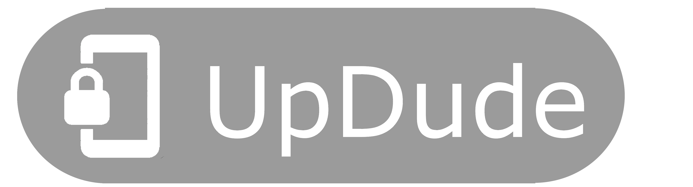

<p align="center">



[](https://github.com/jakic12/UpDude/raw/master/stable.apk/)
</p>

UpDude is an innovative productivity tool that locks your phone until you complete a certain task.

UpDude is designed to be unobtrusitve, lightweight, easy to use and to customize, so you can tailor it to your own needs and preferences.
Here are some example use cases:
 * restrict phone usage before getting out of bed, or before departing to work/school
 * user must go for a walk before using phone in the morning
 * assist with evening procrastination (lock the phone at a specified hour, unlockable in the morning)
 * ensure user brushes teeth for 3 minutes every morning (must leave phone on the tag for 3 minutes)

The following tasks can be used to unlock:
 * scanning a registered NFC tag
 * reaching a specified pedometer count


## Innovation

Existing solutions to morning procrastination mainly consist of alarm clocks that don't stop ringing until you get up, e.g. an alarm clock that runs and hides, or an app that requires you to solve math problems.


Our creative solution beats conventional techniques, because it's not annoying. Our user is never forced to wake up, or wake their housemates. This is because we're not dealing with hypersomnia, but productivity. An awake user won't stay in bed if they're bored, so all we really need to do is take away their phones.


## Business model

As a company, we could sell official BLE beacons or NFC tags with e.g. doorframe or ceiling mounts, and restrict the app to only work with official tags. We made a sample CAD model for a toothbrush holder with an NFC dock, which can be used to enforce a 3 minute brushing session in the morning.


## Extensibility

Our rich configuration model allows for a wide arrangement of use cases, limited only by the user's imagination. We developed a configuration generator powered by AI technology, which aids in finding inventive uses for UpDude.

UpDude also supports Mobile Actions (confirmed to work with Bixby, but should work with others too), which provides a rich environment of if-this-then-that rules, which further increase the utility power of our application.


## Safety

In case of emergency, calls are always allowed from the lock screen, as well as the camera app.
In case of misconfiguration (e.g. user sets unlock task to 20.000 steps instead of 200), a reboot will disable the lock. We trust this emergency failsafe is inconvenent enough for responsible users.


# Development

```
npm i
npx react-native start # start metro
npx react-native run-android # start app
```

`npx react-native run-android` is one way to run your app - you can also run it directly from within Android Studio.
